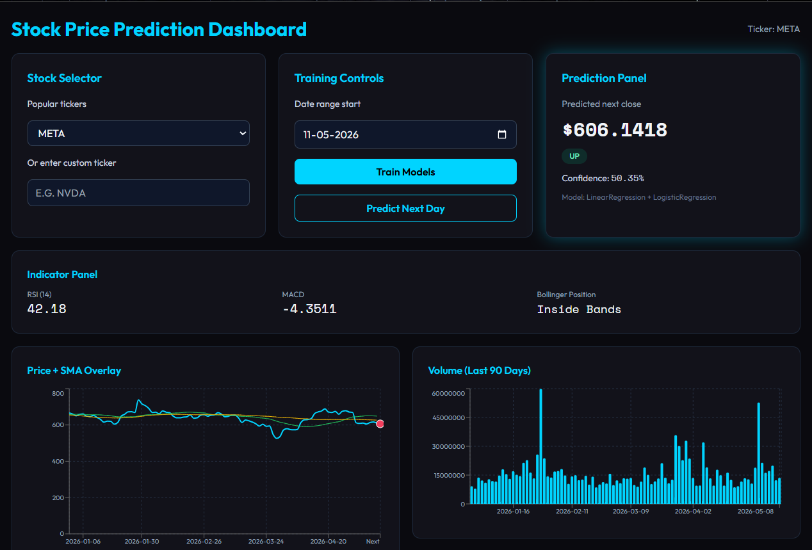

# Stock Price Prediction System using ML

Modern full-stack stock analytics and prediction dashboard using real Yahoo Finance data.

## Preview

Current dashboard preview:



## Features

- Real OHLCV market data from `yfinance` (no mock data)
- Technical indicators with `ta`: RSI, MACD, Bollinger Bands, SMA/EMA, returns, and lag features
- 8 ML models (4 regression + 4 classification) trained on time-ordered splits
- Best model persistence via `joblib`
- FastAPI backend with training, prediction, history, and ticker APIs
- Responsive React UI with dark theme, charts, indicators, and model comparison table

## Tech Stack

- **Backend**: FastAPI, scikit-learn, XGBoost, pandas, numpy, yfinance, ta, joblib
- **Frontend**: React + Vite, Tailwind CSS, Axios, Recharts

## Project Structure

```text
backend/
  main.py
  cache/
  data/
    fetcher.py
    features.py
  models/
    regression.py
    classification.py
  saved_models/
frontend/
  .env.example
  src/
    App.jsx
    api/client.js
    components/
    Images/
      image.png
scripts/
  setup_backend.sh
  run_backend.sh
  run_frontend.sh
  run_all.sh
requirements.txt
README.md
```

## Quick Start

### Quick Start (One Click)
- Windows: Double-click `start.bat` (opens backend + frontend in separate terminal windows)
- Mac/Linux: Run `chmod +x start.sh && ./start.sh`
- PowerShell: Right-click `start.ps1` and choose **Run with PowerShell**

Windows note:
- `start.bat` uses an absolute `ROOT` path. If you move this project folder, update the `SET ROOT=...` line in `start.bat`.

### Quick Start (Manual)

### 1) Backend

From repository root:

```bash
python -m pip install -r requirements.txt
cd backend
uvicorn main:app --reload
```

Backend: `http://127.0.0.1:8000`

If port 8000 is already in use:

```bash
uvicorn main:app --reload --port 8001
```

### 2) Frontend

In another terminal:

```bash
cd frontend
npm install
npm run dev
```

Frontend: `http://localhost:5173`

## Quick Start (Bash Scripts)

Use these from project root:

```bash
chmod +x scripts/*.sh
./scripts/setup_backend.sh
./scripts/run_backend.sh
```

For frontend:

```bash
./scripts/run_frontend.sh
```

To run both:

```bash
./scripts/run_all.sh
```

## Environment Configuration

If backend runs on a custom port, configure frontend API URL:

1. Copy `frontend/.env.example` to `frontend/.env`
2. Set:

```bash
VITE_API_BASE_URL=http://127.0.0.1:8001/api
```

3. Restart frontend dev server.

## API Reference

### `GET /`
Health route:

```json
{ "status": "ok", "message": "Stock API running" }
```

### `GET /api/tickers`
Returns:

```json
["AAPL","TSLA","GOOGL","MSFT","AMZN","NFLX","META"]
```

### `POST /api/train`
Request:

```json
{ "ticker": "AAPL", "start_date": "2019-01-01" }
```

Response includes metrics for all regression/classification models and best model names.

### `POST /api/predict`
Request:

```json
{ "ticker": "AAPL" }
```

Response:

```json
{
  "predicted_price": 0.0,
  "trend": "UP",
  "confidence": 0.0,
  "model_used": "ModelA + ModelB"
}
```

### `GET /api/history/{ticker}`
Returns latest 90 records with OHLCV + indicators.

## Model Details

### Regression Models
- Linear Regression
- Random Forest Regressor
- XGBoost Regressor
- SVR

Metrics: MAE, RMSE, R²

### Classification Models
- Logistic Regression
- Random Forest Classifier
- XGBoost Classifier
- KNN Classifier

Metrics: Accuracy, Precision, Recall, F1

## Validation and Error Handling

- Empty/invalid ticker data returns clear API errors
- Future `start_date` input is normalized server-side
- Feature-engineering safety checks for short data windows
- Prediction endpoint warns if models are not trained yet

## Sample Tickers

`AAPL`, `TSLA`, `GOOGL`, `MSFT`, `AMZN`, `NFLX`, `META`, `NVDA`

## Troubleshooting

- **`pip` not recognized (Windows)**:
  - Use `python -m pip install -r requirements.txt`
- **`git` not recognized**:
  - Install Git and ensure it is added to PATH
- **Port already in use**:
  - Start backend with `--port 8001`
- **Frontend cannot reach backend**:
  - Verify `VITE_API_BASE_URL` and restart `npm run dev`

## License

For educational and demonstration purposes.
